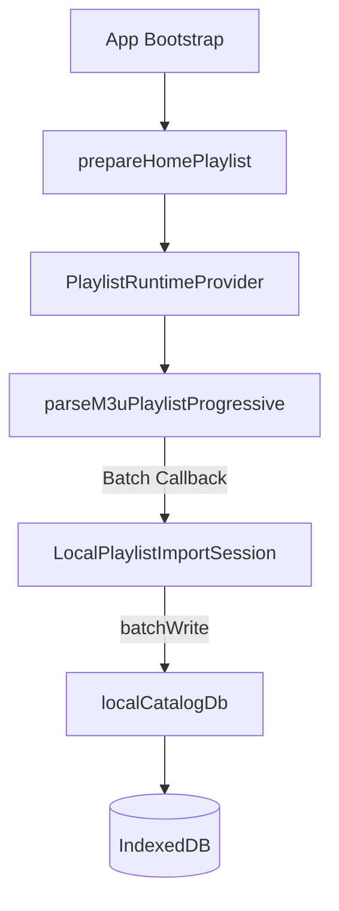

# Arquitetura do Catálogo Local (Local-First) — Issue U2

Este documento descreve a especificação técnica e a arquitetura implementada para o catálogo local (local-first) de VOD e canais na versão Xandeflix 2.0.

---

## 1. Arquitetura Geral

A arquitetura do catálogo local adota uma abordagem de persistência local-first baseada em **IndexedDB**. Ela desonera a API remota do Supabase para o carregamento do catálogo VOD e permite inicialização instantânea e offline de conteúdos autorizados.

O catálogo bruto pode ser consultado localmente após importação; a reprodução continua condicionada à disponibilidade da fonte de mídia e da rede.

---

## 2. Fluxo de Download e Ingestão

### A. Fluxo Único de Download
O download do arquivo M3U ocorre uma única vez por carregamento. Ele é iniciado na camada de runtime pela função `loadDirectSourcePlaylist` dentro do arquivo `src/features/playlists/lib/directSourcePlaylistLoader.ts`. Não há downloads concorrentes ou redundantes entre a interface do usuário (Player/Canais) e o importador local do banco de dados.

### B. Callback Assíncrono em Lotes (Progressivo)
* O parser progressivo em `src/features/playlists/lib/parseM3uPlaylist.ts` faz o parsing de linhas M3U por fluxo de caracteres (`ReadableStream`), gerando lotes parciais de canais (configurável pelo batch size, padrão `250`).
* O callback assíncrono `onChannelsBatch` em `src/features/playlists/providers/PlaylistRuntimeProvider.tsx` recebe cada lote síncrono e dispara a escrita no banco de dados local com `await localImportSession.writeBatch(channelBatch)`.
* A execução do parser aguarda a finalização da escrita no banco de dados para cada lote, mitigando gargalos de I/O em IndexedDB e evitando perda de escrita.

### C. Cancelamento por AbortSignal
O carregamento e a importação suportam cancelamento por `AbortSignal` de forma granular:
1. **Fetch HTTP**: O sinal cancela a requisição ativa de rede.
2. **Parser e escrita**: O sinal cancela fetch e parser e impede novos lotes. Uma escrita IndexedDB que já tenha iniciado pode concluir; a sessão é finalizada como canceled e a remoção de obsoletos não é executada.

---

## 3. Estrutura do IndexedDB (Versão 2)

O banco de dados IndexedDB local (`xandeflix-local-catalog`) foi atualizado para a **versão 2** no arquivo `src/features/localCatalog/services/localCatalogDb.service.ts`.

### A. Stores e Estrutura
1. `playlistItems` (Chave: `id`): Guarda os canais e VODs locais.
2. `catalogMetadata` (Chave: `key`): Registra o progresso e o status da importação.
3. `tmdbMetadata` (Chave: `id`): Cache local de enriquecimentos externos.

### B. Índices Adicionados (Isolamento por sourceId)
Para garantir isolamento de multi-fontes e paginação eficiente por categorias, foram criados os seguintes índices compostos na store `playlistItems`:
* `sourceId` (Indexação simples da fonte)
* `sourceIdContentKind` (Filtro composto `[sourceId, contentKind]`)
* `sourceIdGroupTitle` (Filtro composto `[sourceId, groupTitle]`)
* `sourceIdContentKindGroupTitle` (Filtro composto `[sourceId, contentKind, groupTitle]`)
* `sourceIdContentKindNormalizedGroup` (Filtro composto `[sourceId, contentKind, normalizedGroup]`)

---

## 4. Governança e Regras de Negócio

### A. Identidade SHA-256 Opaca
O ID final de cada item persistido no catálogo local é uma hash SHA-256 opaca, gerada de maneira determinística com a seguinte estrutura concatenada:
`uc_SHA256(v1 + sourceId + tvgId + name + groupTitle + streamUrl)`
Dessa forma, IDs expostos não contêm referências legíveis a credenciais ou URLs IPTV.

### B. Classificação e Unknown
* O classificador determina se o canal representa um filme (`movie`), série (`series`) ou canal de tv ao vivo (`live`).
* O contrato local aceita `radio`, mas a ingestão e classificação funcional de rádio permanece destinada à U3.
* Conteúdos não categorizáveis por padrões conhecidos de VOD ou lives permanecem marcados como `unknown`.
* Elementos sem cabeçalho `#EXTINF` são preservados como `unknown` e nomeados incrementalmente como `Canal X`.

### C. Tratamento de Grupos (Categorias)
* Grupos vazios ou não definidos são atribuídos automaticamente à categoria `"Não categorizados"`.
* Categorias dinâmicas e não predefinidas nas tabelas oficiais do app são criadas de forma dinâmica no banco local a partir da varredura de metadados da playlist.

### D. Conciliação e Reconciliação Consistente
* **Preservação**: Uma importação ativa não apaga os dados antigos durante a execução. O catálogo anterior permanece totalmente disponível para o usuário.
* **Limpeza pós-sucesso**: Apenas após o sucesso total da transação e do sinalizador de progresso como `ready`, o importador invoca `removeObsoleteLocalCatalogItems` para remover os registros com `importSessionId` antigo, mantendo a consistência operacional.

---

## 5. Integração na Interface do Usuário

### A. Home Local-First
A função `loadHomeVodSections` em `src/features/catalog/services/homeVod.service.ts` intercepta a inicialização e busca seções locais VOD caso o metadado da fonte ativa esteja no estado `ready`.

### B. Filmes Local-First
A listagem de filmes por categoria na página `src/features/catalog/pages/CatalogCategoryPage.tsx` lê os itens do read model local `src/features/localCatalog/readModels/localCatalogCategoryReadModel.service.ts` caso o catálogo local esteja pronto.

### C. Fallback Remoto Transparente
Caso o banco local esteja vazio, corrompido, inacessível ou no meio de um processo de importação inicial (status não `ready`), o sistema executa silenciosamente o fallback remoto consumindo dados via API do Supabase e cache.

---

## 6. Segurança e Logs Sensíveis

* **Sanitização de logs**: Mensagens de erro de fontes de rede foram blindadas contra o log de dados confidenciais (códigos de licença, URLs IPTV ou payloads brutos).
* **Logs em Produção**: Chamadas críticas como erros de requisição de playlists foram substituídas por códigos sanitizados genéricos, ex: `AUTHORIZED_IPTV_SOURCE_UNAVAILABLE` e `[PLAYLIST_LINE_REDACTED]`.

---

## 7. Riscos e Limitações

### Riscos Críticos

> [!CAUTION]
> **RISCO_ALTO: Comportamento com Listas Extremamente Grandes**
> Listas IPTV contendo mais de 50.000 itens geram expressivo consumo de CPU durante o parsing SHA-256 e podem esgotar a cota de persistência temporária do navegador (IndexedDB storage quota limits).

> [!WARNING]
> **RISCO_ALTO: Dependência de crypto.subtle**
> A geração de chaves opacas utiliza `crypto.subtle.digest('SHA-256')`. Em navegadores antigos ou ambientes webview inseguros (HTTP sem SSL), a API `crypto.subtle` é undefined, disparando erro de importação.

*   **RISCO_MEDIO: Upgrade de Esquema IndexedDB**
    Dispositivos antigos de TV (Fire Stick legado) podem falhar ou bloquear o processo de upgrade síncrono do IndexedDB (evento `onblocked`).
*   **RISCO_MEDIO: Consumo de memória no Runtime**
    A manutenção da lista completa de canais ao vivo em memória do React pode causar lentidão na renderização sob listas muito grandes.

### Limitações da U2
* Suporte local-first disponível exclusivamente para fontes de formato `m3u`.
* O enriquecimento do TMDB não é mandatório para exibição de itens VOD locais, exibindo metadados básicos caso a chave TMDB esteja indisponível.

---

## 8. Status de Homologação e Implementação

Implementação candidata da U2, validada localmente e aguardando commit e gates.

Os seguintes gates necessitam obrigatoriamente de homologação com dispositivos físicos em laboratório antes da publicação final de produção:
*   **FIRE_STICK_GATE**: PENDENTE_VALIDACAO_FISICA (Aguardando teste de performance do IndexedDB em hardware real).
*   **TABLET_GATE**: PENDENTE_VALIDACAO_FISICA (Aguardando teste de toques sucessivos e cancelamento de fluxo).
*   **MOBILE_DATA_GATE**: PENDENTE_VALIDACAO_FISICA (Aguardando homologação de consumo de tráfego móvel no download inicial de playlist).

---

## 9. Plano de Rollback Pós-Commit

Caso seja necessário reverter a implantação da Issue U2 pós-commit, os seguintes commits devem ser revertidos na ordem inversa da criação:

1.  `git revert <SHA_COMMIT_DOCUMENTACAO>` (Reverte arquivos de documentação e diagramas)
2.  `git revert <SHA_COMMIT_INTEGRACAO_UI>` (Reverte alterações visuais na Home e Categorias de Filmes)
3.  `git revert <SHA_COMMIT_IMPORTACAO_STORAGE>` (Reverte atualizações em IndexedDB, Repositórios e Parser progressivo)

### Notas Operacionais importantes:
*   **Banco de dados e Esquemas**: Reverter o código-fonte **não reduz** automaticamente a versão do IndexedDB (`LOCAL_CATALOG_DB_VERSION`).
*   **Esquema versão 2**: Bancos locais em dispositivos que já foram atualizados para a versão 2 continuarão operando sob essa versão.
*   **Limpeza do DB**: Stores e índices adicionados não serão apagados automaticamente. No entanto, o rollback operacional garante que a interface do usuário lerá corretamente do fallback remoto sem quebrar, preservando os dados locais e de rede.
