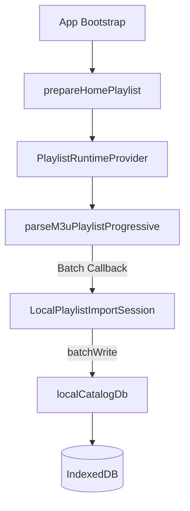

# Arquitetura do Catálogo Local (Local-First) — Issue U2

Este documento descreve a especificação técnica e a arquitetura implementada para o catálogo local-first de VOD e canais na versão Xandeflix 2.0.

---

## 1. Arquitetura Geral

A arquitetura do catálogo local adota persistência local-first baseada em **IndexedDB**. Após uma importação bem-sucedida, o catálogo bruto pode ser consultado localmente para montar seções VOD sem depender de uma nova consulta remota para cada leitura.

A reprodução continua condicionada à disponibilidade da fonte de mídia e da rede.

---

## 2. Fluxo de Download e Ingestão

### A. Fluxo Único de Download

O download do arquivo M3U ocorre uma única vez por carregamento. Ele é iniciado na camada de runtime pela função `loadDirectSourcePlaylist`, em `src/features/playlists/lib/directSourcePlaylistLoader.ts`. Não há download adicional exclusivo para o importador local.

### B. Callback Assíncrono em Lotes

- O parser progressivo em `src/features/playlists/lib/parseM3uPlaylist.ts` processa a playlist por fluxo de caracteres (`ReadableStream`) e gera lotes parciais, com batch padrão `250`.
- O callback assíncrono `onChannelsBatch` em `src/features/playlists/providers/PlaylistRuntimeProvider.tsx` encaminha cada lote ao importador por meio de `await localImportSession.writeBatch(channelBatch)`.
- O parser aguarda a escrita de cada lote antes de prosseguir, reduzindo o risco de perda de escrita e concorrência descontrolada no IndexedDB.

### C. Cancelamento por AbortSignal

O carregamento e a importação suportam cancelamento por `AbortSignal`:

1. **Fetch HTTP**: o sinal cancela a requisição ativa de rede.
2. **Parser e escrita**: o sinal cancela fetch e parser e impede novos lotes. Uma escrita IndexedDB já iniciada pode concluir; a sessão é finalizada como `canceled` e a remoção de obsoletos não é executada.

---

## 3. Estrutura do IndexedDB — Versão 2

O banco local `xandeflix-local-catalog` foi atualizado para a versão 2 em `src/features/localCatalog/services/localCatalogDb.service.ts`.

### A. Stores

1. `playlistItems`, chave `id`: itens de catálogo locais.
2. `catalogMetadata`, chave `key`: progresso e status de importação.
3. `tmdbMetadata`, chave `id`: cache local de enriquecimento externo.

### B. Índices por sourceId

Foram adicionados à store `playlistItems`:

- `sourceId`;
- `sourceIdContentKind` — `[sourceId, contentKind]`;
- `sourceIdGroupTitle` — `[sourceId, groupTitle]`;
- `sourceIdContentKindGroupTitle` — `[sourceId, contentKind, groupTitle]`;
- `sourceIdContentKindNormalizedGroup` — `[sourceId, contentKind, normalizedGroup]`.

O upgrade não remove stores ou índices existentes.

---

## 4. Governança e Regras de Negócio

### A. Identidade SHA-256 Opaca

O identificador final de cada item é um hash SHA-256 determinístico, baseado internamente em:

`v1 + sourceId + tvgId + name + groupTitle + streamUrl`

O identificador exposto segue o formato `uc_<hash>` e não contém URL, credencial ou `sourceId` em texto legível.

### B. Classificação e unknown

- O classificador atual distingue `movie`, `series`, `live` e `unknown` conforme os dados disponíveis.
- O contrato local aceita `radio`, mas a ingestão e classificação funcional de rádio permanece destinada à U3.
- Conteúdo inconclusivo permanece como `unknown`.
- Linhas reproduzíveis sem `#EXTINF` são preservadas como `unknown` e recebem nome sintético sequencial.

### C. Categorias

- Grupo vazio ou ausente é exposto como `Não categorizados`.
- Grupos não predefinidos são preservados e geram categorias locais dinamicamente.
- A normalização é utilizada para comparação, sem substituir o texto original de exibição.

### D. Reconciliação

- Uma importação em andamento não apaga previamente o catálogo anterior.
- Os novos lotes são persistidos com `importSessionId`.
- Itens obsoletos são removidos somente após a conclusão bem-sucedida da importação.
- Em cancelamento ou erro, lotes já persistidos podem coexistir temporariamente com itens anteriores até uma próxima importação bem-sucedida.

---

## 5. Integração na Interface

### A. Home Local-First

`loadHomeVodSections`, em `src/features/catalog/services/homeVod.service.ts`, tenta carregar seções locais quando a metadata da fonte M3U ativa está em `ready`. Quando não há catálogo utilizável, o fluxo remoto legado é preservado.

### B. Filmes Local-First

`src/features/catalog/pages/CatalogCategoryPage.tsx` consulta `src/features/localCatalog/readModels/localCatalogCategoryReadModel.service.ts` para obter filmes e categorias dinâmicas da fonte ativa. Falha ou ausência de dados locais mantém o fallback remoto.

### C. Cards sem TMDB

O mapeamento local usa título e grupo da playlist e, quando seguro, o logo original. TMDB, pôster e backdrop não são requisitos para visibilidade do item.

---

## 6. Segurança e Logs

- Logs de autorização não incluem código de licença, token ou payload bruto.
- Diagnósticos de linha M3U são redigidos como `[PLAYLIST_LINE_REDACTED]`.
- Erros de fonte autorizada usam códigos sanitizados, como `AUTHORIZED_IPTV_SOURCE_UNAVAILABLE`.
- `.env.local`, listas reais e credenciais não fazem parte do diff.
- URLs de reprodução permanecem no IndexedDB por necessidade funcional, mas não são incluídas em logs ou identificadores visíveis.

---

## 7. Riscos e Limitações

### Riscos altos

- **Listas muito grandes**: parsing, hashing e escrita de dezenas de milhares de itens podem gerar pressão de CPU, memória e quota do IndexedDB.
- **Integração no runtime**: importação em lotes durante o bootstrap pode competir com renderização e navegação em dispositivos TV de baixa capacidade.
- **Falha intermediária**: lotes novos podem coexistir temporariamente com o catálogo anterior até uma importação posterior concluir a reconciliação.

### Riscos médios

- **Disponibilidade de `crypto.subtle`**: ambientes antigos ou contextos inseguros podem impedir geração dos IDs.
- **Upgrade IndexedDB**: conexões antigas abertas podem bloquear temporariamente a atualização para versão 2.
- **Memória do runtime React**: a lista completa de canais continua mantida em memória pelo fluxo atual.
- **Rede lenta**: o primeiro download autorizado continua dependente da qualidade da conexão.

### Limitações da U2

- O local-first funcional cobre fontes `m3u`.
- Xtream, séries estruturadas, episódios e rádio funcional permanecem destinados à U3.
- Gates físicos em Fire Stick, tablet e dados móveis ainda não foram executados.

---

## 8. Status de Homologação

A implementação candidata da U2 está commitada e publicada na PR #21, permanecendo em Draft enquanto aguarda revisão técnica e gates físicos.

- `FIRE_STICK_GATE=PENDENTE_VALIDACAO_FISICA`
- `TABLET_GATE=PENDENTE_VALIDACAO_FISICA`
- `MOBILE_DATA_GATE=PENDENTE_VALIDACAO_FISICA`

---

## 9. Plano de Rollback

Após integração, reverter os commits na ordem inversa:

1. `git revert <HEAD_DOCUMENTAL_DA_PR>` — documentação e handoff.
2. `git revert 140180491467cd99163f00cce63fb3219743d4a3` — integração da Home e de Filmes.
3. `git revert e60dfae6101ef52ba1a521aaca0da9c540799004` — IndexedDB v2, parser progressivo e importação local.

Reverter o código não reduz automaticamente a versão do IndexedDB. Bancos já atualizados para versão 2 permanecem nessa versão, e stores ou índices adicionais não devem ser removidos automaticamente.
