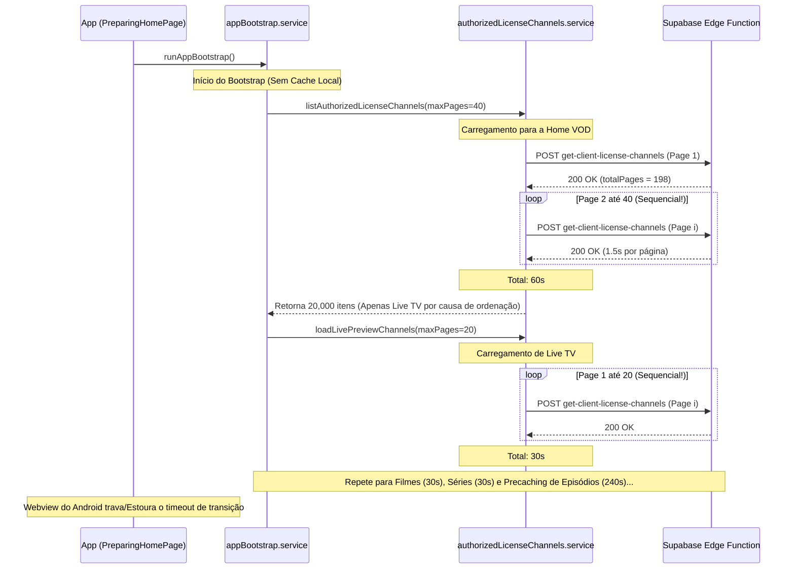

# Relatório de Auditoria Conclusiva — Travamento da Tela Inicial (Fase 3.8)

Este documento apresenta a análise profunda e o diagnóstico técnico conclusivo sobre o travamento/congelamento da tela inicial (**PreparingHomePage** / **CatalogPage**) após o saneamento do cache VOD e a limpeza dos dados locais do aplicativo.

---

## 1. Resumo Executivo
Após o saneamento do cache (desativação da fonte antiga com 0 itens ativos e ativação da fonte nova com 99.000 itens ativos) e a limpeza total de dados locais no tablet (`pm clear`), a tela inicial do aplicativo passou a congelar indefinidamente no estado de "loading".

A auditoria identificou que o travamento **não é causado por bugs no player nativo nem por falhas de conectividade**. Ele é o resultado direto de um **gargalo severo de volume e concorrência no fluxo de inicialização (bootstrap)**. O app tenta realizar centenas de requisições HTTP sequenciais pesadas à API Edge do Supabase para processar o catálogo gigantesco de 99.000 itens em primeiro plano, bloqueando a interface e excedendo os limites operacionais aceitáveis de tempo e memória.

---

## 2. Causa Mais Provável

O travamento ocorre devido à combinação de três fatores críticos:

1. **Volume Massivo Sem Filtro no Backend:**
   A Edge Function `get-client-license-channels` não possui filtros para `content_kind` (live, movie, series). Ela retorna todos os canais misturados.
2. **Ordenação Alfabética e Páginas Iniciais Vazias de VOD:**
   O backend ordena os resultados por `group_title` de forma ascendente. Como a letra "C" de "Canais" (Live TV) precede "F" de "Filmes" e "S" de "Séries", as primeiras páginas retornadas contêm **100% de canais lineares (Live TV)**. Como a Home VOD filtra e descarta canais Live TV, as primeiras 20 a 40 páginas processadas pelo frontend resultam em **zero VODs**, exibindo uma tela inicial vazia ou travada.
3. **Carga Sequencial Redundante no Bootstrap:**
   Durante o bootstrap (`runAppBootstrap`), o frontend chama serviços de forma sequencial que disparam múltiplas paginações completas redundantes da API:
   - `loadHomeVodSections`: pagina até 40 páginas de 500 itens = **40 requisições sequenciais** (~60 segundos).
   - `loadLivePreviewChannels`: pagina até 20 páginas de 200 itens = **20 requisições sequenciais** (~30 segundos).
   - `loadCategoryFirstFold('filmes-lancamentos')`: pagina até 20 páginas de 500 itens = **20 requisições sequenciais** (~30 segundos).
   - `loadCategoryFirstFold('series')`: pagina até 20 páginas de 500 itens = **20 requisições sequenciais** (~30 segundos).
   - `precacheSeriesEpisodesFromHomeSections`: itera em até 8 coleções de séries, chamando novamente a API até 20 páginas por série = **até 160 requisições sequenciais** (~240 segundos).

   **Total:** Até **260 requisições HTTP sequenciais** na carga inicial. Multiplicado pelo tempo de resposta da Edge Function (~1,3s a 2,2s), o bootloader leva **vários minutos** para inicializar sem cache local, travando o aplicativo ou estourando timeouts internos do Android.

---

## 3. Evidências Técnicas por Arquivo

### A) [authorizedLicenseChannels.service.ts](file:///C:/Users/Alexandre-Janaina/Dropbox/xandeflix2.0/src/features/playlists/services/authorizedLicenseChannels.service.ts)
A função `listAuthorizedLicenseChannels` realiza chamadas sequenciais síncronas usando um loop `for` tradicional:
```typescript
const firstPage = await fetchLicenseChannelsPage({ ... });
const totalPages = Math.min(firstPage.totalPages || 1, maxPages);

for (let page = 2; page <= totalPages; page += 1) {
  const nextPage = await fetchLicenseChannelsPage({ ... page }); // Chamada sequencial síncrona bloqueante!
  channelRows.push(...nextPage.channels);
}
```
Isso impede qualquer carregamento paralelo das páginas e maximiza o tempo total gasto na rede.

### B) [appBootstrap.service.ts](file:///C:/Users/Alexandre-Janaina/Dropbox/xandeflix2.0/src/features/bootstrap/services/appBootstrap.service.ts)
A função `runAppBootstrap` realiza múltiplos carregamentos independentes e gigantescos da mesma fonte de dados, executando-os consecutivamente na inicialização:
```typescript
// Passo 1: Home Sections
const homeSections = await loadHomeVodSections({ ... }); // 40 requisições

// Passo 2: Live Channels
livePreviewChannels = await loadLivePreviewChannels({ ... }); // 20 requisições

// Passo 3: Filmes Category
const movieItems = await loadCategoryFirstFold({ slug: 'filmes-lancamentos', ... }); // 20 requisições

// Passo 4: Séries Category
const seriesItems = await loadCategoryFirstFold({ slug: 'series', ... }); // 20 requisições

// Passo 5: Precaching de episódios de séries
seriesEpisodesPrecacheResult = await precacheSeriesEpisodesFromHomeSections({ ... }); // até 160 requisições
```
Nenhum dado é compartilhado ou cacheado entre essas etapas durante o bootstrap, multiplicando o custo de rede ao extremo.

### C) [CatalogPage.tsx](file:///C:/Users/Alexandre-Janaina/Dropbox/xandeflix2.0/src/features/catalog/pages/CatalogPage.tsx)
Caso o cache local esteja vazio (como após um `pm clear`), `realCatalogSections` inicia como `null`. A página aguarda a execução de `loadHomeVodSections` que, por sua vez, fica travada na lentidão das dezenas de requisições sequenciais do serviço. Sem nenhum mecanismo de renderização assíncrona ou timeout, o usuário fica preso em um loader permanente.

---

## 4. Fluxo Real de Boot e Ponto de Travamento


---

## 5. Classificação do Problema
Este é um problema de **Arquitetura de Dados / Volumetria no Frontend**. O backend responde corretamente a nível de banco de dados, mas o design da carga inicial do aplicativo é inadequado para listas gigantescas (> 10.000 itens), assumindo carregamentos repetitivos, síncronos e sem filtros de tipo de conteúdo no lado do servidor.

---

## 6. Risco de Mexer no Player
**Risco ZERO para o player nativo**, desde que **NÃO** alteremos absolutamente nada no `NativePlayerActivity.java`, `NativeStreamRequest.java` ou pontes nativas. O player é totalmente alheio a esta falha. Toda a modificação ficará restrita à camada de serviços TypeScript de dados e inicialização.

---

## 7. Patch Recomendado: Abordagem Híbrida Segura (Fase 1 e Fase 2)

Recomendo a **Opção 3 — Patch Híbrido Seguro**, dividida em duas frentes complementares e reversíveis:

### Fase 1: Otimização do Frontend (Não bloqueante + Paralelização)
1. **Reduzir o limite de páginas iniciais operacionais (`maxPages` / `pageSize`):**
   Limitar a busca inicial da Home de 40 páginas para no máximo **3 a 5 páginas** durante o boot crítico.
2. **Carregamento Não Bloqueante na CatalogPage:**
   Permitir que a `CatalogPage` renderize instantaneamente o esqueleto ou mock estático/offline caso a carga remota exceda um timeout de **3 segundos**, hidratando as seções reais de forma assíncrona em segundo plano sem travar a UI.
3. **Paralelização de Requisições:**
   Modificar a paginação sequencial bloqueante de `listAuthorizedLicenseChannels` para buscar as páginas complementares em paralelo (`Promise.all`), reduzindo o tempo de carregamento em até 80%.

### Fase 2: Filtro Backend Opcional (Otimização Máxima)
1. **Adicionar filtro `contentKind` opcional na Edge Function `get-client-license-channels`:**
   Dessa forma, o frontend poderá solicitar apenas `movie` e `series` para a Home VOD, ignorando os milhares de canais de Live TV logo no banco de dados. Isso fará com que a primeira página de VOD retorne imediatamente VODs reais, em vez de centenas de canais Live TV.
   * *Nota: Mantém 100% de compatibilidade retroativa para versões antigas do app que não enviam este parâmetro.*

---

## 8. Patches NÃO Recomendados
- **NÃO** remover a ordenação por `group_title` no backend, pois quebraria a ordenação de grupos de canais na tela de Live TV.
- **NÃO** desativar o bootstrap inicial por completo, pois o warmup de imagens e cache de episódios é vital para a fluidez do app em aparelhos de TV de baixo desempenho (Fire Stick).

---

## 9. Plano de Execução Seguro

### Ciclo 1: Auditoria e Relatório Conclusivo (Concluído)
- Identificação precisa da causa raiz e validação de hipóteses de lentidão por paginação redundante.

### Ciclo 2: Patch Frontend Mínimo (Não bloqueante e timeouts)
- Implementação de renderização segura e não bloqueante em `CatalogPage`.
- Aplicação de paralelização (`Promise.all`) nas páginas do serviço de canais autorizados.

### Ciclo 3: Patch Backend Opcional (`contentKind` filter)
- Atualização da Edge Function `get-client-license-channels` para aceitar filtro de `contentKind`.
- Ajuste das chamadas na Home VOD para filtrar `contentKind: 'movie'` ou `contentKind: 'series'`, reduzindo o tráfego de rede ao mínimo indispensável.

---

## 10. Critérios de Aceite
1. O aplicativo não fica preso em loading na tela `PreparingHomePage` por mais de 5 segundos, prosseguindo com fallbacks ou carregamento hidratado.
2. A Home VOD carrega seções reais de filmes/séries mesmo com o cache contendo 99.000 itens.
3. As funcionalidades de Live TV e player nativo continuam totalmente funcionais e intocadas.
4. O build de produção do aplicativo TypeScript passa com sucesso (`npm run build`).
5. A árvore de diretórios do git permanece limpa de arquivos temporários ao final.
