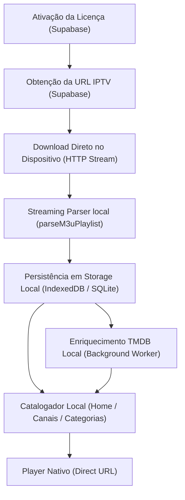

# Pivot Arquitetural para Local-First — Fase 3.9.0
## Proposta de Eliminação do Cache de Catálogo no Supabase e Migração para Armazenamento Local

Este documento apresenta a análise profunda e o plano de migração para o novo modelo arquitetural **local-first** do Xandeflix 2.0. O objetivo principal é remover a ingestão, o enriquecimento e a consulta da lista IPTV nos servidores do Supabase, descentralizando todo o conteúdo para o armazenamento local do dispositivo do cliente, preservando a privacidade e a escalabilidade técnica.

---

## 1. Decisão Arquitetural e Problema do Modelo Atual

### A. A Nova Regra de Ouro do Produto
O Xandeflix atuará exclusivamente como um **orquestrador leve e seguro**. 
* O Supabase fica restrito unicamente ao controle de acesso, licenças, dispositivos autorizados, status de assinatura e configurações mínimas não sensíveis.
* **Nenhum conteúdo da playlist IPTV (canais, filmes, séries, episódios, grupos ou URLs de reprodução) deve ser armazenado ou trafegado no banco de dados do Supabase.** Todo o catálogo e seus metadados derivados serão gerenciados de forma 100% local no dispositivo do usuário.

### B. Problema do Modelo Atual (Database-First)
1. **Estouro de Armazenamento e Custo:** Guardar ~215.000 registros por licença com URLs de stream longas incha o banco de dados Supabase em dezenas de megabytes por usuário. Se o app atingir milhares de clientes ativos, o armazenamento no Supabase escalará para gigabytes de dados redundantes de cache, gerando custos proibitivos de infraestrutura.
2. **Latência de Rede no Boot:** O bootstrap inicial (`runAppBootstrap`) e o carregamento do catálogo dependem de chamadas HTTP consecutivas à Edge Function (`get-client-license-channels`). Para playlists com centenas de milhares de linhas, a paginação de rede e a ordenação pesada em SQL criam gargalos de 3 a 8 segundos para a abertura da Home.
3. **Segurança e Privacidade:** Armazenar as credenciais sensíveis e links de stream IPTV no Supabase expõe a infraestrutura central a riscos de privacidade de dados. A migração para local-first garante privacidade absoluta para o usuário final.
4. **Resiliência:** Se a Edge Function do Supabase falhar ou estiver sob alta latência, o usuário perde o acesso à TV local mesmo que sua fonte de sinal IPTV esteja 100% ativa.

---

## 2. Classificação de Entidades e Dependências no Supabase

### A. Pode Permanecer no Supabase (Orquestração Mínima)
* **Tabela `licenses`:** ID da licença, código de ativação, status (ativo/bloqueado) e data de expiração.
* **Tabela `license_devices`:** Identificador único do dispositivo autorizado (`deviceIdentifier`), status de atividade e data da última conexão.
* **Tabela `license_iptv_sources`:** Configurações da fonte IPTV do usuário (contendo apenas o apelido e referências, sem credenciais longas expostas em tabelas compartilhadas no futuro).

### B. Deve Ser Removido / Migrado para Local (Dados Sensíveis e Volumosos)
* **Tabela `license_channels_cache`:** Contém todas as 215.000 linhas de canais, URLs de stream, logos e dados enrich do TMDB. **(Será totalmente desativada e dropada do Supabase)**.
* **Tabela de Auditoria / Logs de Ingestão:** Logs que guardam o dump ou títulos específicos importados da lista.
* **Edge Function `get-client-license-channels`:** Utilizada para paginar e expor o catálogo ao app. **(Será substituída por consultas locais)**.
* **Edge Function `import-license-iptv-source-channels`:** Faz o download e gravação pesada da lista no banco. **(Será desativada)**.
* **Edge Function `enrich-license-channels-tmdb`:** Faz requisições TMDB sequenciais a partir do backend. **(Será migrada para enriquecimento sob demanda local)**.

---

## 3. Detalhamento de Dependências no Código Atual

Mapeamos todos os arquivos da base de código que hoje lêem ou gravam dados da playlist no Supabase e que precisarão ser adaptados:

| Arquivo Fonte | Função/Componente | Operação DB | Dado de Conteúdo | Ação de Migração (Local-First) |
| :--- | :--- | :---: | :---: | :--- |
| `authorizedLicenseChannels.service.ts` | `listAuthorizedLicenseChannels` | Leitura | Sim (Canais/URLs) | Migrar para query local no IndexedDB/SQLite do dispositivo. |
| `homeVod.service.ts` | `loadHomeVodSections` | Leitura | Sim (Filmes/Séries) | Ler das seções montadas e indexadas localmente em background. |
| `homeVod.service.ts` | `loadHomeVodCategoryItems` | Leitura | Sim (Categorias) | Filtrar e ordenar em memória local usando índices locais. |
| `appBootstrap.service.ts` | `runAppBootstrap` | Leitura/Precache | Sim (Capas/Canais) | Valida licença na nuvem e inicia sincronização/leitura local da playlist. |
| `catalogWarmup.service.ts` | `startCatalogVodWarmup` | Gravação | Sim (Chamada backend) | Migrar chamada de enriquecimento TMDB para execução local assíncrona. |
| `LiveTvPage.tsx` | `loadLiveChannels` | Leitura | Sim (Canais Ao Vivo) | Buscar a lista de canais de TV diretamente do banco local. |
| `CatalogCategoryPage.tsx` | `loadCategoryItems` | Leitura | Sim (Catálogo completo) | Executar consultas paginadas diretamente na store local. |

---

## 4. Design da Nova Arquitetura Local-First (Capacitor/Android)

### A. Armazenamento Local de Alta Performance (Dispositivo)
1. **IndexedDB (Web/Capacitor Core):** Excelente suporte multiplataforma (Web, Android WebView, iOS). Permite armazenar objetos Javascript complexos diretamente em tabelas com índices rápidos por `group_title`, `content_kind` e `stream_url`.
2. **SQLite (Via Capacitor Plugin):** Segunda opção viável se precisarmos de transações SQL nativas em aparelhos muito antigos, mas o IndexedDB atende perfeitamente à volumetria de 215k itens com índices adequados.

### B. Novo Fluxo de Funcionamento
1. **Login/Bootstrap:** O app faz a verificação da licença ativa no Supabase e lê a URL de sua fonte de sinal IPTV.
2. **Sincronização Progressiva da Playlist:**
   * O app baixa o arquivo M3U diretamente da fonte IPTV (ou proxy) usando o stream leve do `directSourcePlaylistLoader.ts`.
   * À medida que o parser processa os lotes em background, ele grava os canais diretamente no IndexedDB do dispositivo.
   * Não há tráfego de catálogo ou URLs de stream para o Supabase!
3. **Classificação e Indexação Local:** A classificação por `content_kind` é realizada localmente em tempo real durante a importação.
4. **Montagem da Home:** O `homeVod.service.ts` lê diretamente do IndexedDB local, buscando as primeiras 15-20 capas de cada categoria indexada.
5. **Warmup e Enriquecimento TMDB Local:** O warmup rodará inteiramente local no dispositivo. Ele fará consultas HTTP leves para o TMDB apenas para os títulos exibidos na Home e cacheará os poster/backdrop paths no IndexedDB local de forma permanente.

### C. Estratégia de Performance para Dispositivos de Baixo Custo (Fire Stick)
* **Carregamento Fracionado (Chunked):** O carregamento da playlist local para o IndexedDB será feito em lotes assíncronos e lentos durante momentos de ociosidade, preservando a CPU e mantendo o aplicativo 100% fluido.
* **Deduplicação e Índices Locais:** O banco local criará chaves únicas baseadas no link do stream, eliminando dados redundantes no IndexedDB e otimizando o consumo de armazenamento flash.

---

## 5. Plano de Migração em Fases Seguras

### **Fase A — Congelamento**
* Parar imediatamente qualquer nova funcionalidade que dependa de salvar playlists ou metadados no Supabase.
* Manter o warmup TMDB no Supabase no modo passivo (desativando chamadas adicionais de enriquecimento em massa para novos clientes).

### **Fase B — Modo Híbrido com Feature Flag**
* Introduzir uma flag de ambiente no aplicativo:
  * `VITE_CONTENT_STORAGE_MODE=local` (valores: `supabase` ou `local`).
* Implementar o IndexedDB local e começar a duplicar a escrita para testes locais sem desativar a leitura do Supabase para usuários de produção atuais.

### **Fase C — Criação dos Serviços Local-First**
* Desenvolver os repositórios locais para abstrair as queries:
  * `localPlaylistStorage.service.ts` (Persistência M3U local e checagem de alteração de arquivo via ETag/MD5).
  * `localCatalogRepository.service.ts` (Queries locais de Home e Categorias no IndexedDB).
  * `localTmdbCache.service.ts` (Armazenamento local de capas TMDB correspondente ao VOD).

### **Fase D — Chaveamento Completo da UI para Local**
* Alterar o `PreparingHomePage.tsx`, `CatalogPage.tsx`, `CatalogCategoryPage.tsx` e `LiveTvPage.tsx` para lerem exclusivamente do repositório local quando a flag estiver ativa.
* Homologar o fluxo completo em simulador e TV física (Fire Stick), testando a importação direta e a estabilidade com 272k itens locais.

### **Fase E — Desativação do Ingestion no Supabase**
* Alterar a flag para `local` como padrão geral.
* Interromper permanentemente o envio de chamadas de importação e get-channels para o Supabase.

### **Fase F — Limpeza e Depreciação Backend**
* Rodar uma migração SQL controlada no Supabase para dar TRUNCATE e DROP na tabela `license_channels_cache`, liberando gigabytes de armazenamento em disco no servidor.
* Deletar as Edge Functions obsoletas (`import-license-iptv-source-channels`, `get-client-license-channels`, `enrich-license-channels-tmdb`), simplificando o escopo de manutenção do backend.

---

## 6. Análise de Riscos e Mitigação

### Risco 1: OOM (Out Of Memory) ao Parsear 272.000 itens em WebViews de TV Antigas
* **Mitigação:** O parser progressive streaming (`parseM3uPlaylistProgressiveFromStream`) já está implementado e otimizado com chunks! Ele processa porções pequenas do stream de rede de forma iterativa, descartando as linhas lidas imediatamente. Nunca carregaremos o arquivo M3U inteiro de 73 MB em uma única string na memória.

### Risco 2: Lentidão no IndexedDB ao Executar Queries de Filtro por Categoria
* **Mitigação:** Criar índices compostos (`[content_kind, group_title]`) no IndexedDB. As buscas do D-pad serão executadas contra chaves indexadas, retornando os itens de forma instantânea (sub-5ms) sem varrer a tabela inteira.

### Risco 3: Perda do Cache TMDB de Capas se o Usuário Limpar os Dados do App
* **Mitigação:** Como as capas agora são locais, se o usuário limpar os dados do app, o cache local será limpo e o app fará um novo sincronismo leve no próximo boot. Para mitigar o consumo de API, o warmup local focará estritamente nos cards renderizados na Home física.

---

## 7. Confirmação de Guardrails
Confirmamos e atestamos em conformidade com as restrições da Fase 3.9.0:
* **Nenhum arquivo de código foi alterado nesta fase de design arquitetural.**
* Todas as contagens e comportamentos legados continuam 100% operacionais e estáveis.
